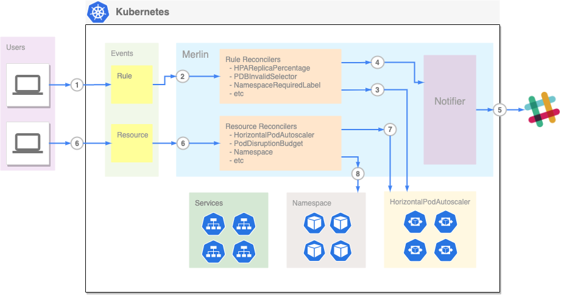

# Merlin

## About

## Background

Kubernetes gives us the flexibility to run various workloads dynamically, but it's also easy to
have mis-configurations, lost track of resources (that became useless and should be deleted),
or sometimes configurations no longer meet the requirements and should be updated.

For example, if we update the label of pods, and due to this change, the corresponding service 
also needs to update the selector, even you remember to update it, there might also be PDB 
(pod disruption budget) that needs to be update as well. A simple change can lead to a sequence
of changes, and it's easy to forget or miss anyone of them. 

### Problems

We want a solution to detect issues automatically, whenever there's a resource change,
it'll check corresponding resources and warn us if there's any problems, below is the list 
problems that Merlin is trying to address:

- **Mis-configured resource**: Kubernetes uses labels to select relevant objects, but each object 
  can be independently updated, thus it’s easy to miss other objects that also need to be updated.
- **Missing configurations**: we need to make sure some configurations are there, for example, 
  currently we require namespaces to enable istio-injection by default, but this can be 
  disabled explicitly, so we can have a rule for making sure this label is set. Another 
  example is Prometheus, we can make sure the pod or service has annotation for Prometheus. 
- **Dangling**: Kubernetes objects are declarative, the objects can be represented as yaml or 
  json, internally Kubernetes has generations and UID to uniquely identify the object, 
  however those information are usually not being tracked in the original yaml file, because 
  UID is generated when you create the object for the first time. So after you modified the 
  metadata name, when you apply the file again it’s actually going to create a whole new 
  object instead of updating existing one. This leaves the old resource dangling.
- **Inappropriate or out-dated**: sometimes we want to avoid some problematic settings, properties, 
  or status for Kubernetes resources, for example, if one pod is requesting a very high amount of 
  memory or CPU, as long as it’s under the resource limit, it’ll still be created, however 
  this might cause the namespace to run out of resources, so we might want to either prevent 
  each pod to request too much resource, or have a rule to check namespace resource utilizations. 
  Another example is HPA percentage, if one HPA’s current replica is reaching the max, we might 
  want to know such events and see if we need to adjust the max value.
  
One thing to note is that Merlin only **notify** the issue, you can take it as a suggestion, but 
it wont take any correction actions since you might have external sources to apply changes like 
CICD pipeline or terraform, or you might have resources that might be invalid for a period of time
but will be used shortly. 

## Technical 

### Architecture
The project uses [kubebuilder](https://github.com/kubernetes-sigs/kubebuilder) to build the 
controllers, each resource type that we’d like to check will have one controller, i.e., 
we have individual controllers for pod, deployment, service, etc. In the future we might 
add more controllers for other types of resources. 

This gives us the flexibility and scoped perspective when adding/developing controllers. 
However, this also brings the issues when performing cross-resources reconciliations, e.g., 
when user is updating pod labels and that can break service, we might want to wait a little 
until we’re sure user forgets to update service, since the user might be using a pipeline that
updates pods first then services, in such cases we don’t want to send out warning immediately, 
before the pipeline updates services (so the service is still correct, it’s just invalid in 
a short amount of time.).



### Components

The following explains the components in Merlin.

#### Notifier

**Notifier** is the component that talks to external systems such as Slack or PagerDuty and notify 
any issues with the resources. Each Notifier has the following properties in its spec.
- **notifyInterval**: that specify how often a notifier should send notifications for violations changes. 
- **slack**: Specify slack properties, currently there are 
  - **severity**: default severity for this channel, can be overridden by rule
  - **channel**: the slack channel
  - **webhookURL**: the webhook URL from slack.

Example Spec:

```yaml
apiVersion: merlin.mercari.com/v1beta1
kind: Notifier
metadata:
  name: slack-notification
spec:
 notifyInterval: 30 # seconds
 slack:
   severity: "warning" # every channel has its default severity, but can be override by the rule
   channel: "your_channel"
   webhookURL: "your_webhook_url"
```


for details specs for each rule you can run 
```bash
kubectl describe crd notifier
```

#### Rules

Rules are requirements for Kubernetes resources, each rule is a Kubernetes Custom Resource, 
which is an object created for particular CRD (Custom Resource Definition). Each rule can its own logic
to determine under what conditions the resource is considered violated, and the violations will be added 
to notifiers waiting to be sent out.

There are two kinds of rules, i.e., **ClusterRule** and **Rule**, they work at different scope, 
**ClusterRule** is cluster wide resource and Rule is namespaced resource while .

##### ClusterRules

A **ClusterRule** works as cluster wide requirement, it’ll be applied to target resources across 
all namespaces, unless a namespace is either 1) explicitly ignored or 2) has any corresponding Rule. 

A ClusterRule has following common properties (and depends on the requirements, there might be 
other properties depend on different rules.):
- **ignoreNamespaces**: list of namespaces name for this rule to ignore.
- **notification((: defines the notification related settings, has following properties:
  - **notifiers**: the list of notifiers for this rule,
  - **severity**: custom severity for this rule, if not specified, will use the notifier’s default severity.
  - **suppressed**: if this alert should be suppressed, useful for developing new rules and resources that  
  - **customMessageTemplate**: a custom message template, if not specified, will use DefaultMessageTemplate. 
    There are several variables can be used in the customMessageTemplate:
    - `{{.Severity}}`: the severity of the alert.
    - `{{.ResourceKind}}`:  the resource kind which has the violation, same as the resource’s Kind, 
      such as namespace, deployment, service, etc.
    - `{{.ResourceName}}`: the resource name which has the violation, same as the resource’s metadata 
      name.
    - `{{.DefaultMessage}}`: the rule’s default message.

For example, the following is the rule for `ClusterRuleHPAReplicaPercentage`: 
```yaml
apiVersion: merlin.mercari.com/v1beta1
kind: ClusterRuleHPAReplicaPercentage
metadata:
  annotations:
  name: cluster-rule-hpa-replica-percentage-90
spec:
  ignoreNamespaces:
  - kube-system
  notification:
    notifiers:
    - slack-notification
    severity: warning
  percent: 90
```
in this example, it ignores the `kube-system` namespace, and sets notification to `slack-notification` with severity `warning`,
and this `ClusterRuleHPAReplicaPercentage` has a field called `percent` that specifies on what percentage when the hpa reaches
the alert should fire, this field might not exist in other rules, or they might have different meaning if same field exists. 

for details specs for each rule you can run 
```bash
kubectl describe crd <clusterrule>
```

there are also some samples in `config/samples` folder you can refer to

##### Rules

A **Rule** is similar to ClusterRule but only applies to a specific namespace, it has higher precedence 
over ClusterRule. Note currently if a namespace has any corresponding Rule defined, only the Rule 
will be applied and none of ClusterRule will be applied to the namespace.

There are several common properties for Rule’s Spec (similar to ClusterRule, other properties depend 
on the rules):
- **selector**: defines the target resource for this rule to apply, can specify by either one of the following:
- **name**: the target resource name, e.g., PDB name, HPA name, etc.
- **matchLabels**: resource labels, same concept as kubernetes matchLabels.
- **notification**: same as ClusterRule’s notification setting, see ClusterRule for details.


The following in an example of rule `RuleHPAReplicaPercentage`:
```yaml
apiVersion: merlin.mercari.com/v1beta1
kind: RuleHPAReplicaPercentage
metadata:
  namespace: default
  name: rule-hpa-replica-percentage-100
spec:
 selector: # selector is only for namespaced rule
   name: nginx
   matchLabels:
     app: nginx
 notification:
   notifiers:
     - slack-notification
   suppressed: false
   customMessageTemplate: "[{{.Severity}}] [`{{.ResourceName}}`] HPA current replica number percentage is 100%"
   severity: warning
 percent: 100
```
since **Rule** is a namespaced resource, this rule is defined in `default` namespace, with selector that selects hpa named `nginx`
and label with `app=nginx`, in the notification it overwrites the message template with a new template. And similarly `percent` field 
is only for this `RuleHPAReplicaPercentage`.

for details specs for each rule you can run 
```bash
kubectl describe crd <rule>
```

there are also some samples in `config/samples` folder you can refer to

#### Controllers

There are three types of controllers, each reconciles different type of resources:
1. **Notifier** controller: reconciles for notifiers, whenever there's a notifier CRD gets updated or 
   added, this controller will reconcile for it. When Merlin starts, notifiers gets initialized first, 
   the other controllers will wait for notifiers to become ready.  
1. **Rule** controllers: each rule will have is own controller, note if a ClusterRule and corresponding 
   Rule, then they consider as same rule, hence will only have one controller. Rule controller reconciles 
   events for rule changes, if a rule changes, all the resources that the rule watches and not ignored 
   will be reconciled. 
1. **Resource** controllers: each resource that Merlin has rule for will have its own resource controller
   that takes applicable rules and whenever there's a change for the resource, all the applicable rules
   for that resource will be evaluated. Note the resource controllers will wait for rule and notifiers to
   become ready.

## Known Issues

## FAQ

- Does merlin have persistent storage?

No, it’s using rules’ and notifiers’ status to store the violations and alerts.

- Why does it use status to store violations? 

Simplify implementations: since we don't expose merlin data on its own API, it’s easier to check what 
violations each rule has by list the rules and status.
No external dependencies required, it’s better we just leverage Kubernetes and memory to store the 
status/states, Merlin isn't really a mission critical process, so some inconsistency or loss of data 
temporarily is fine as long as it can recover. 

## References

Here are a list of references that you might find useful.

Kubebuilder
- https://book.kubebuilder.io/introduction.html
- https://github.com/kubernetes-sigs/kubebuilder
- https://github.com/kubernetes-sigs/controller-runtime
- CRD validation: https://book.kubebuilder.io/reference/markers/crd-validation.html
https://godoc.org/github.com/kubernetes-sigs/controller-runtime/pkg

Kubernetes API
- https://github.com/kubernetes/community/blob/master/contributors/devel/sig-architecture/api-conventions.md
- https://github.com/kubernetes/community/tree/master/contributors/design-proposals/api-machinery

Kubectl
- https://kubectl.docs.kubernetes.io/

Admission webhooks
- https://banzaicloud.com/blog/k8s-admission-webhooks/
Kind cluster:
- https://kind.sigs.k8s.io/
- List of api resources (KIND): https://docs.google.com/spreadsheets/d/1K61A--Szmk4GpMq_-xITUj05h-WJQN6OzecqfkuPL30/edit?folder=1R6QQLVKr-v8WDCi0iqeKXkvPWsA98GQ6#gid=0 (kubectl api-resource)

Kubernetes operators: 
- https://github.com/operator-framework/awesome-operators

E2E Test:
- https://github.com/kubernetes-sigs/kubebuilder/issues/920
- https://github.com/microsoft/azure-databricks-operator/blob/0f722a710fea06b86ecdccd9455336ca712bf775/controllers/secretscope_controller_test.go
- https://github.com/govargo/sample-controller-kubebuilder/blob/master/controllers/foo_controller_test.go
- https://github.com/jetstack/kubebuilder-sample-controller/blob/master/controllers/mykind_controller_test.go
- http://engineering.pivotal.io/post/gp4k-kubebuilder-lessons/ (useful but using kubebuilder v1)
- http://engineering.pivotal.io/post/gp4k-kubebuilder-tdd/ (useful but using kubebuilder v1)
- https://ymmt2005.hatenablog.com/entry/2019/08/10/Writing_and_testing_Kubernetes_webhooks_using_Kubebuilder_v2
 
